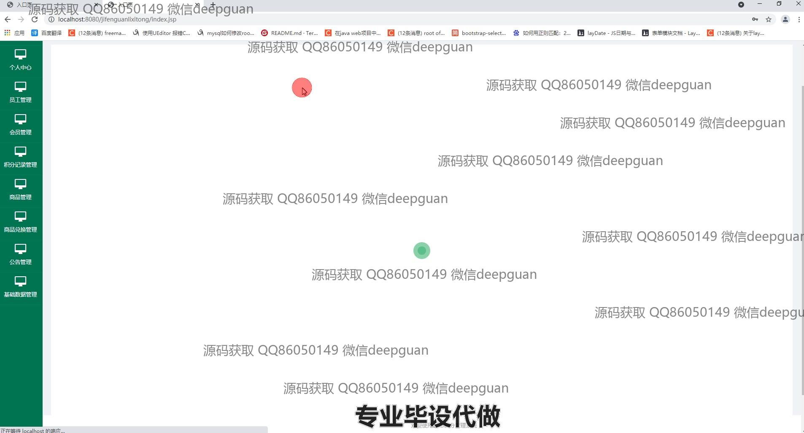
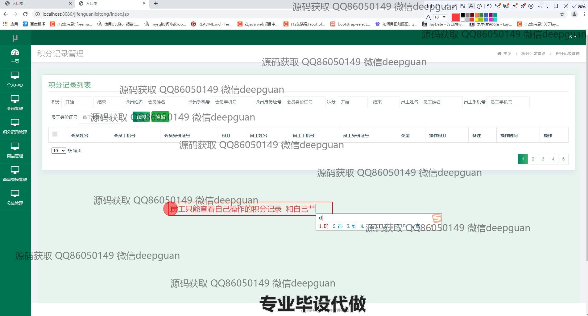
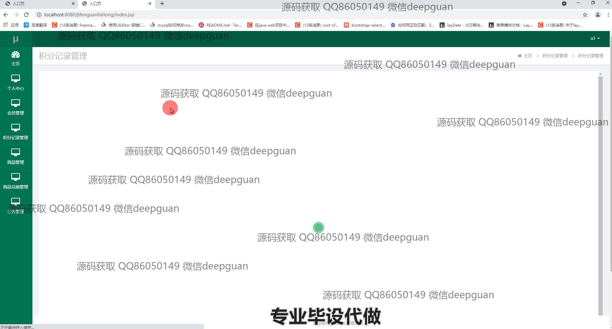

<h1 align="center">超市会员（积分)管理系统</h1>

## 简介
超市会员积分管理系统：角色分为管理员、用户；功能包括会员管理、员工管理、积分记录管理、商品管理、商品兑换管理、公告管理、基础数据管理。    --计算机毕业设计源码；毕设源码；java毕业设计源码

## 联系方式

<h3 align="center">获取完整代码与数据库文件 + 微信：deepguan QQ: 86050149 QQ群: 783742310</h3>

<h3 align="center">可帮忙远程部署 包运行成功！提供远程部署、修改代码、设计文档指导、代码讲解等服务！</h3>

## 功能介绍（完整见运行截图）
管理员：可以通过系统进行员工管理、会员管理、积分记录管理、商品管理、商品类别管理和公告管理等操作。支持员工信息的添加、修改和上传照片功能。在积分记录管理中，可以查询和添加积分记录，按会员或员工信息进行筛选，并查看记录的详细信息。管理员还能够管理物资类型，操作包括查看、修改、删除和批量管理物资类型。系统允许商品信息的管理，包括输入商品详情、上传图片、修改或删除商品信息等。

员工：可通过系统管理个人及所属模块内的任务，包含更新或修改个人资料，协助管理商品与会员信息。系统为员工提供商品信息录入与管理的操作界面，功能包括商品的搜索、修改、查看和删除。

会员：可以通过个人中心查看和更新个人信息，积分详情和积分变动记录均可在系统中查询和管理。会员进行商品的兑换时，可以通过系统查看商品类别与详细信息。系统允许为后续兑换和使用而查看当前积分和历史积分记录。

访客：访问系统时，可以查看公告以及部分商品信息，但受限于权限无法进行任何管理操作。访客界面简洁，展示功能模块，如商品信息和公告内容等基本信息。

## 运行截图

本代码来源于网络,仅供学习参考使用!

